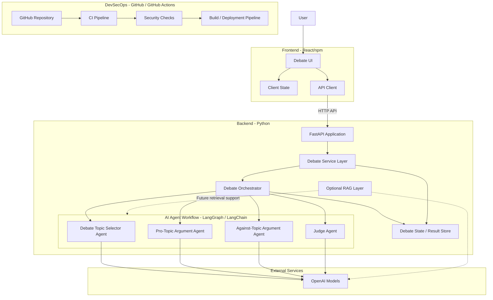

# High-Level Solution Architecture

Source inputs:

- `Requirements Document for a Debate application.docx`
- `docs/agile/EPICS.md`
- `docs/agile/USER_STORIES.md`

## Architecture Diagram

## Component Responsibilities

| Component | Responsibility |
| --- | --- |
| React Frontend | Presents the debate topic, agent turns, and judge result to the user. |
| API Client | Calls backend APIs to start debates and retrieve debate state or results. |
| FastAPI Application | Exposes backend HTTP APIs for the frontend. |
| Debate Service Layer | Encapsulates application use cases and validates debate operations. |
| Debate Orchestrator | Controls debate flow: topic selection, random first speaker, turn sequencing, and judging. |
| Debate Topic Selector Agent | Selects the debate topic and initiates the debate flow. |
| Pro-Topic Argument Agent | Produces arguments in favor of the selected topic. |
| Against-Topic Argument Agent | Produces arguments against the selected topic. |
| Judge Agent | Evaluates the completed debate and decides the winner. |
| OpenAI Models | Provide model inference for the AI agents. |
| Optional RAG Layer | Reserved for future retrieval-augmented debate context if required. |
| Debate State / Result Store | Stores selected topic, turns, arguments, and final result. Storage technology is not decided yet. |
| GitHub Actions | Runs future CI, security checks, build, and deployment automation. |

## Key Runtime Flow

1. The user opens the React frontend.
2. The frontend calls the FastAPI backend to start a debate.
3. The backend service delegates the debate run to the debate orchestrator.
4. The topic selector agent selects a topic.
5. The orchestrator randomly selects the first argument agent.
6. The pro-topic and against-topic agents each speak three times.
7. The judge agent evaluates the completed debate and selects the winner.
8. The backend stores or returns the debate state and final result.
9. The frontend presents the topic, argument turns, and winner.

## Design Assumptions

- The backend owns debate orchestration and agent execution.
- The frontend is a presentation and interaction layer, not an agent orchestration layer.
- LangGraph is the preferred fit for modeling the debate workflow because the process has explicit states and transitions.
- LangChain may be used for model integration, prompt handling, and optional future retrieval flows.
- The persistence mechanism is intentionally undecided at this stage.
- Deployment target is intentionally undecided at this stage.

## Deferred Design Decisions

- API endpoint contract.
- Debate state schema.
- Storage technology.
- Prompt templates and agent memory strategy.
- RAG data sources and retrieval strategy.
- Authentication and authorization requirements.
- Hosting and deployment environment.
- Detailed GitHub Actions workflow definitions.

