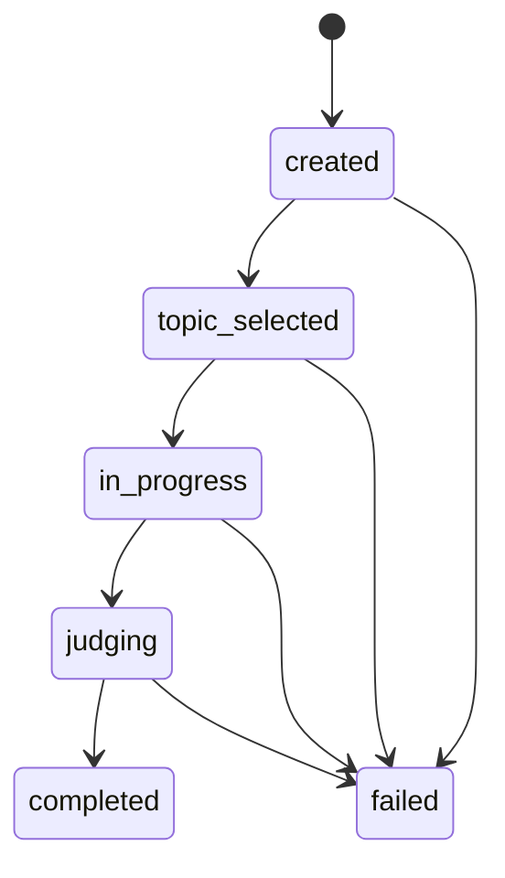

# Low-Level API Design

Source inputs:

- `Requirements Document for a Debate application.docx`
- `docs/agile/USER_STORIES.md`
- `docs/design/HIGH_LEVEL_ARCHITECTURE.md`

This document defines the backend API contract for the debate application. Deployment architecture is intentionally out of scope.

## API Design Goals

- Expose a small frontend-friendly API for starting and viewing AI debates.
- Keep debate orchestration inside the backend.
- Return enough state for the frontend to display the selected topic, agent turns, and final winner.
- Support asynchronous debate execution without requiring the frontend to hold a long-running HTTP request open.
- Provide predictable response and error shapes for frontend handling.

## Base API

| Item | Value |
| --- | --- |
| API base path | `/api/v1` |
| Content type | `application/json` |
| Authentication | Deferred. No auth contract is defined in this design. |
| API framework | FastAPI |

## Resource Model

Primary resource:

- `Debate`

Supporting nested resources:

- `DebateTurn`
- `DebateResult`
- `AgentRole`

## Debate Lifecycle



## Enumerations

### DebateStatus

| Value | Meaning |
| --- | --- |
| `created` | Debate record has been created. |
| `topic_selected` | Topic selector agent has selected the topic. |
| `in_progress` | Argument agents are speaking. |
| `judging` | Judge agent is evaluating the debate. |
| `completed` | Debate has completed successfully. |
| `failed` | Debate failed and cannot continue. |

### AgentRole

| Value | Meaning |
| --- | --- |
| `topic_selector` | Agent that selects topic and initiates debate. |
| `pro` | Agent arguing in favor of the topic. |
| `con` | Agent arguing against the topic. |
| `judge` | Agent deciding the debate winner. |

### WinningSide

| Value | Meaning |
| --- | --- |
| `pro` | Pro-topic agent won. |
| `con` | Against-topic agent won. |

## API Endpoints

### 1. Health Check

Used by local development and future operational checks.

```http
GET /api/v1/health
```

#### Response: `200 OK`

```json
{
  "status": "ok",
  "service": "agentic-debate-api"
}
```

### 2. Start Debate

Creates a new debate and starts backend orchestration.

```http
POST /api/v1/debates
```

#### Request Body

The BRD says the topic is selected by the topic-selector agent, so no topic is required from the user.

```json
{
  "mode": "automatic"
}
```

#### Request Fields

| Field | Type | Required | Rules |
| --- | --- | --- | --- |
| `mode` | string | No | Defaults to `automatic`. Only `automatic` is supported in the initial API design. |

#### Response: `202 Accepted`

The debate may execute asynchronously after creation.

```json
{
  "debate_id": "deb_01HY7W9M8K2P2Z6W3F1A9D0QAB",
  "status": "created",
  "topic": null,
  "starting_side": null,
  "created_at": "2026-04-26T18:30:00Z",
  "updated_at": "2026-04-26T18:30:00Z",
  "links": {
    "self": "/api/v1/debates/deb_01HY7W9M8K2P2Z6W3F1A9D0QAB"
  }
}
```

### 3. Get Debate

Returns the current state of a debate, including topic, turns, and result when available.

```http
GET /api/v1/debates/{debate_id}
```

#### Path Parameters

| Parameter | Type | Required | Rules |
| --- | --- | --- | --- |
| `debate_id` | string | Yes | Must identify an existing debate. |

#### Response: `200 OK`

```json
{
  "debate_id": "deb_01HY7W9M8K2P2Z6W3F1A9D0QAB",
  "status": "completed",
  "topic": "Should AI agents be used for formal debate training?",
  "starting_side": "pro",
  "created_at": "2026-04-26T18:30:00Z",
  "updated_at": "2026-04-26T18:31:20Z",
  "turns": [
    {
      "turn_number": 1,
      "agent_role": "pro",
      "content": "AI agents can help learners practice structured arguments...",
      "created_at": "2026-04-26T18:30:10Z"
    },
    {
      "turn_number": 2,
      "agent_role": "con",
      "content": "Formal debate training requires human judgment and context...",
      "created_at": "2026-04-26T18:30:20Z"
    }
  ],
  "result": {
    "winner": "pro",
    "judge_summary": "The pro side presented clearer structure and stronger supporting points.",
    "created_at": "2026-04-26T18:31:20Z"
  },
  "error": null
}
```

### 4. List Debates

Returns recent debates for display or debugging.

```http
GET /api/v1/debates
```

#### Query Parameters

| Parameter | Type | Required | Default | Rules |
| --- | --- | --- | --- | --- |
| `limit` | integer | No | `20` | Minimum `1`, maximum `100`. |
| `status` | string | No | None | Optional `DebateStatus` filter. |

#### Response: `200 OK`

```json
{
  "items": [
    {
      "debate_id": "deb_01HY7W9M8K2P2Z6W3F1A9D0QAB",
      "status": "completed",
      "topic": "Should AI agents be used for formal debate training?",
      "starting_side": "pro",
      "created_at": "2026-04-26T18:30:00Z",
      "updated_at": "2026-04-26T18:31:20Z",
      "result": {
        "winner": "pro",
        "judge_summary": "The pro side presented clearer structure and stronger supporting points.",
        "created_at": "2026-04-26T18:31:20Z"
      }
    }
  ],
  "limit": 20,
  "count": 1
}
```

### 5. Get Debate Turns

Returns only the argument turns for a debate.

```http
GET /api/v1/debates/{debate_id}/turns
```

#### Response: `200 OK`

```json
{
  "debate_id": "deb_01HY7W9M8K2P2Z6W3F1A9D0QAB",
  "topic": "Should AI agents be used for formal debate training?",
  "turns": [
    {
      "turn_number": 1,
      "agent_role": "pro",
      "content": "AI agents can help learners practice structured arguments...",
      "created_at": "2026-04-26T18:30:10Z"
    }
  ]
}
```

### 6. Get Debate Result

Returns only the judge result for a completed debate.

```http
GET /api/v1/debates/{debate_id}/result
```

#### Response: `200 OK`

```json
{
  "debate_id": "deb_01HY7W9M8K2P2Z6W3F1A9D0QAB",
  "status": "completed",
  "result": {
    "winner": "pro",
    "judge_summary": "The pro side presented clearer structure and stronger supporting points.",
    "created_at": "2026-04-26T18:31:20Z"
  }
}
```

#### Response: `409 Conflict`

Returned when the debate exists but judging is not complete.

```json
{
  "error": {
    "code": "DEBATE_NOT_COMPLETED",
    "message": "Debate result is not available until judging is complete.",
    "details": {
      "debate_id": "deb_01HY7W9M8K2P2Z6W3F1A9D0QAB",
      "status": "in_progress"
    }
  }
}
```

## Data Schemas

These schemas are intended to map directly to future Pydantic models.

### StartDebateRequest

| Field | Type | Required | Description |
| --- | --- | --- | --- |
| `mode` | string | No | Debate execution mode. Initial supported value: `automatic`. |

### DebateSummary

| Field | Type | Required | Description |
| --- | --- | --- | --- |
| `debate_id` | string | Yes | Unique debate identifier. |
| `status` | DebateStatus | Yes | Current debate status. |
| `topic` | string or null | Yes | Selected debate topic, null before topic selection completes. |
| `starting_side` | WinningSide or null | Yes | Randomly selected first argument side, null before selection. |
| `created_at` | datetime | Yes | Creation timestamp in UTC. |
| `updated_at` | datetime | Yes | Last update timestamp in UTC. |
| `result` | DebateResult or null | No | Result summary when available. |

### DebateDetail

| Field | Type | Required | Description |
| --- | --- | --- | --- |
| `debate_id` | string | Yes | Unique debate identifier. |
| `status` | DebateStatus | Yes | Current debate status. |
| `topic` | string or null | Yes | Selected debate topic. |
| `starting_side` | WinningSide or null | Yes | First argument side. |
| `created_at` | datetime | Yes | Creation timestamp in UTC. |
| `updated_at` | datetime | Yes | Last update timestamp in UTC. |
| `turns` | DebateTurn[] | Yes | Debate turns generated so far. |
| `result` | DebateResult or null | Yes | Judge result when available. |
| `error` | ErrorDetail or null | Yes | Failure detail when status is `failed`. |

### DebateTurn

| Field | Type | Required | Description |
| --- | --- | --- | --- |
| `turn_number` | integer | Yes | One-based sequence number. |
| `agent_role` | AgentRole | Yes | `pro` or `con` for argument turns. |
| `content` | string | Yes | Agent-generated argument text. |
| `created_at` | datetime | Yes | Turn timestamp in UTC. |

### DebateResult

| Field | Type | Required | Description |
| --- | --- | --- | --- |
| `winner` | WinningSide | Yes | Winning side selected by the judge agent. |
| `judge_summary` | string | Yes | Short explanation of the judge decision. |
| `created_at` | datetime | Yes | Result timestamp in UTC. |

### ErrorResponse

| Field | Type | Required | Description |
| --- | --- | --- | --- |
| `error.code` | string | Yes | Stable application error code. |
| `error.message` | string | Yes | Human-readable error message. |
| `error.details` | object | No | Structured diagnostic fields safe to return to the frontend. |

## Error Codes

| HTTP Status | Code | Scenario |
| --- | --- | --- |
| `400` | `INVALID_REQUEST` | Request body or query parameter is invalid. |
| `404` | `DEBATE_NOT_FOUND` | Debate ID does not exist. |
| `409` | `DEBATE_NOT_COMPLETED` | Result requested before judging completes. |
| `409` | `DEBATE_FAILED` | Debate exists but failed during orchestration. |
| `500` | `INTERNAL_ERROR` | Unexpected server error. |
| `502` | `MODEL_PROVIDER_ERROR` | OpenAI or model orchestration dependency failed. |

## Orchestration Rules Exposed Through API State

- A debate must have one selected topic.
- The first argument side must be randomly selected from `pro` and `con`.
- The pro agent must produce exactly three argument turns.
- The con agent must produce exactly three argument turns.
- The judge result must not be produced until both sides have completed three turns.
- A completed debate must include a winner of `pro` or `con`.

## Frontend Polling Contract

The initial API design assumes simple polling from the React frontend.

1. Frontend calls `POST /api/v1/debates`.
2. Backend returns `202 Accepted` with a `debate_id`.
3. Frontend polls `GET /api/v1/debates/{debate_id}` until status is `completed` or `failed`.
4. Frontend renders topic, turns, and result from the latest response.

Server-sent events or WebSockets are deferred until there is a requirement for real-time streaming.

## Story Traceability

| Story | API Coverage |
| --- | --- |
| US-001 Start An Automated Debate | `POST /debates`, `GET /debates/{debate_id}` |
| US-002 Select A Debate Topic | `GET /debates/{debate_id}` returns `topic` |
| US-003 Initiate Debate After Topic Selection | Debate lifecycle and `status` transitions |
| US-004 Provide A Pro-Topic Argument Agent | `turns[].agent_role = pro` |
| US-005 Provide An Against-Topic Argument Agent | `turns[].agent_role = con` |
| US-006 Limit Each Argument Agent To Three Speaking Turns | Orchestration rules and returned turns |
| US-007 Randomly Select The Starting Argument Agent | `starting_side` |
| US-008 Judge The Debate Winner | `GET /debates/{debate_id}/result`, `result.winner` |
| US-009 Expose Backend Debate Capabilities | Full API surface |
| US-010 Present Debate Flow In The Frontend | Detail and list responses provide display data |

## Deferred API Decisions

- Authentication and user identity.
- Multi-user debate ownership.
- Manual topic input.
- Streaming turn updates.
- Pagination beyond simple `limit`.
- Persistent storage implementation.
- Prompt configuration APIs.
- Admin or observability APIs.

